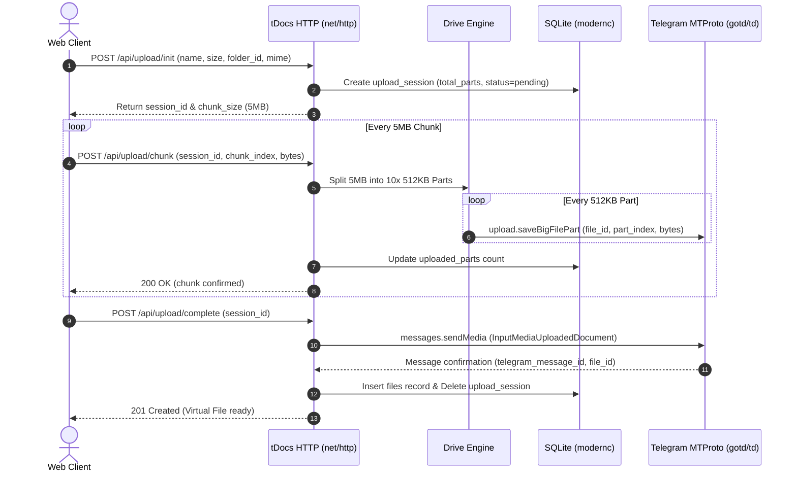
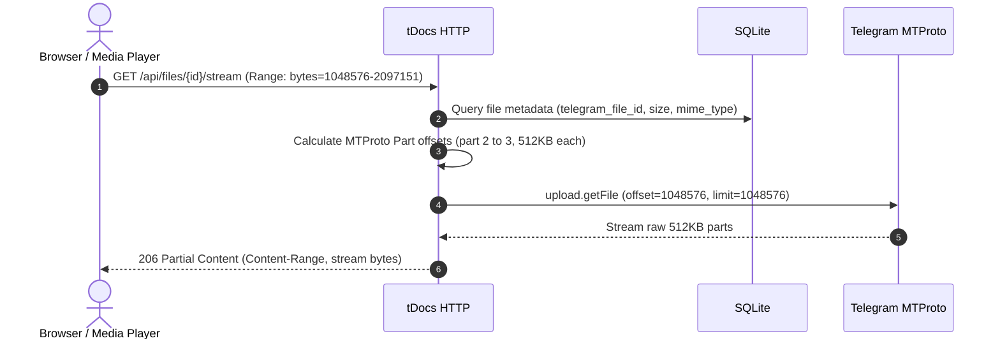
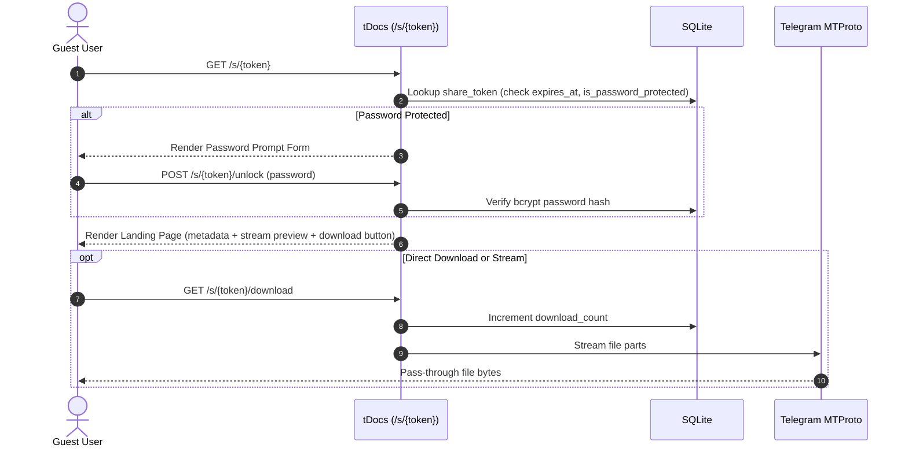
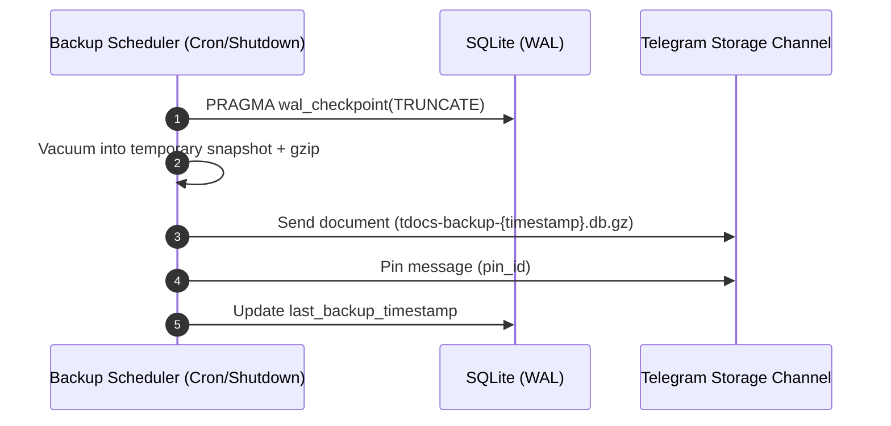

# tDocs Architecture

tDocs is a single-binary cloud storage system that bridges a web interface and virtual file system to Telegram's distributed cloud infrastructure via MTProto.

---

## 1. System Overview

```
+---------------------------------------------------------------------------------+
|                                tDocs Host                                   |
|                                                                                 |
|  +--------------------------+   +-------------------------+   +-------------------+  |
|  |     Web UI (Browser)     |   |   Embedded Dashboard    |   |     CLI Tool      |  |
|  | (HTML5/Vanilla/CSS/SVG)  |<->| (net/http + templates)  |<->| (tdocs login) |  |
|  +--------------------------+   +-------------------------+   +-------------------+  |
|                                         |                                       |
|                                         v                                       |
|                        +---------------------------------+                      |
|                        |       Drive Core Engine         |                      |
|                        | - Virtual Folder Tree           |                      |
|                        | - Resumable Upload Coordinator  |                      |
|                        | - Range Request Streamer        |                      |
|                        | - Share Link Authorizer         |                      |
|                        +---------------------------------+                      |
|                               |                   |                             |
|                               v                   v                             |
|                  +----------------------+  +---------------------+              |
|                  | SQLite Metadata (WAL)|  | Telegram MTProto    |              |
|                  | - modernc.org/sqlite |  | - gotd/td client    |              |
|                  | - AES-GCM Sessions   |  | - 512KB Part Worker |              |
|                  +----------------------+  +---------------------+              |
+-------------------------------------------------------|-------------------------+
                                                        | MTProto TCP/TLS
                                                        v
                                          +---------------------------+
                                          | Telegram Cloud Platform   |
                                          | (Storage Channel Vault)   |
                                          +---------------------------+
```

---

## 2. Core Workflows

### 2.1 Resumable Upload Flow

The client browser slices large files into 5 MB–10 MB **Chunks**. tDocs receives each chunk, slices it into 512 KB MTProto **Parts**, streams them directly to Telegram via `gotd/td`, and tracks the upload session in SQLite.



---

### 2.2 Download & Media Streaming Flow (HTTP 206 Range)

To preview videos or resume partial downloads, tDocs translates HTTP byte-range requests directly into MTProto part offsets without buffering the entire file.



Two latency controls keep player startup and seeking fast:

1. **Resolve cache** — mapping `file → channel message/document` is memoised for a
   short TTL, so a burst of `Range` requests (player warm-up, seek, resume) does
   one `channels.getMessages` round-trip instead of one per request.
2. **Stream warm-up** — the UI resolves the signed stream URL and lets the video
   element fetch metadata (`preload="metadata"`) *before* the user presses play,
   so pressing play does not wait on a cold MTProto handshake.

---

### 2.3 Share Link Flow

Public visitors access files via cryptographic tokens. Passwords and expiry are validated at the edge before streaming bytes.



---

### 2.4 Disaster Recovery & Backup Flow

The SQLite database is backed up to the dedicated Storage Channel periodically and on shutdown.



---

### 2.5 Telegram Connection Verification (honest states)

A stored `APP_ID`/`APP_HASH` is *configuration*, not connectivity, so the server
never derives `CONNECTED` from settings alone. `telegramState(ctx, force)`
runs a live probe (`storage.Backend.Health`: transport reachable → session
authorised → Storage Channel resolvable → read/write permission) and maps the
result onto one of:

| State | Meaning |
| :--- | :--- |
| `not_configured` | No API credentials on this host |
| `connecting` | Probe in flight |
| `authentication_required` | Credentials present, session missing/expired |
| `connected` | Probe succeeded (cached 30 s) |
| `disconnected` | Transport/Storage Channel unreachable or timed out |
| `error` | Authenticated but Telegram returned an error |

Handlers that cannot serve without storage call `requireTelegram`, which emits
`503 telegram_storage_unavailable` with the state and a non-secret message, so
the UI shows an honest degraded panel rather than a 500 or an empty list.

---

## 3. Database Schema (SQLite)

```sql
-- Virtual Folder hierarchy (deleted_at = Trash; NULL = live)
CREATE TABLE folders (
    id TEXT PRIMARY KEY,
    parent_id TEXT NULL REFERENCES folders(id) ON DELETE CASCADE,
    name TEXT NOT NULL,
    created_at DATETIME DEFAULT CURRENT_TIMESTAMP,
    updated_at DATETIME DEFAULT CURRENT_TIMESTAMP,
    deleted_at DATETIME NULL  -- added by migration on older DBs
);
CREATE INDEX idx_folders_parent ON folders(parent_id);

-- Virtual Files mapped to Telegram objects (deleted_at = Trash; NULL = live)
CREATE TABLE files (
    id TEXT PRIMARY KEY,
    folder_id TEXT NULL REFERENCES folders(id) ON DELETE SET NULL,
    name TEXT NOT NULL,
    size INTEGER NOT NULL,
    mime_type TEXT NOT NULL,
    telegram_message_id INTEGER NOT NULL,
    telegram_file_id TEXT NOT NULL,
    telegram_access_hash TEXT NOT NULL,
    sha256 TEXT,  -- SHA-256 accumulated server-side per upload chunk
    created_at DATETIME DEFAULT CURRENT_TIMESTAMP,
    updated_at DATETIME DEFAULT CURRENT_TIMESTAMP,
    deleted_at DATETIME NULL  -- added by migration on older DBs
);
CREATE INDEX idx_files_folder ON files(folder_id);
CREATE INDEX idx_files_name ON files(name);

-- Starred files
CREATE TABLE favorites (
    file_id TEXT PRIMARY KEY REFERENCES files(id) ON DELETE CASCADE,
    created_at DATETIME DEFAULT CURRENT_TIMESTAMP
);

-- Previous copies archived on same-name upload (restorable)
CREATE TABLE file_versions (
    id TEXT PRIMARY KEY,
    file_id TEXT NOT NULL REFERENCES files(id) ON DELETE CASCADE,
    name TEXT NOT NULL,
    size INTEGER NOT NULL,
    mime_type TEXT NOT NULL,
    telegram_message_id INTEGER NOT NULL,
    telegram_file_id TEXT NOT NULL,
    telegram_access_hash TEXT NOT NULL,
    sha256 TEXT NOT NULL DEFAULT '',
    created_at DATETIME DEFAULT CURRENT_TIMESTAMP
);

-- Machine API tokens (only SHA-256 hashes stored; secrets shown once)
CREATE TABLE api_tokens (
    id TEXT PRIMARY KEY,
    name TEXT NOT NULL,
    prefix TEXT NOT NULL,
    token_hash TEXT NOT NULL,
    created_at DATETIME DEFAULT CURRENT_TIMESTAMP,
    last_used_at DATETIME NULL,
    revoked_at DATETIME NULL
);

-- Security-relevant action log (actor, action, detail, ip)
CREATE TABLE audit_logs (
    id INTEGER PRIMARY KEY AUTOINCREMENT,
    created_at DATETIME DEFAULT CURRENT_TIMESTAMP,
    actor TEXT NOT NULL DEFAULT '',
    action TEXT NOT NULL DEFAULT '',
    detail TEXT NOT NULL DEFAULT '',
    ip TEXT NOT NULL DEFAULT ''
);

-- Channel sync history for the Sync Center
CREATE TABLE sync_runs (
    id INTEGER PRIMARY KEY AUTOINCREMENT,
    started_at DATETIME DEFAULT CURRENT_TIMESTAMP,
    finished_at DATETIME NULL,
    trigger TEXT NOT NULL DEFAULT '',
    scanned INTEGER NOT NULL DEFAULT 0,
    inserted INTEGER NOT NULL DEFAULT 0,
    updated INTEGER NOT NULL DEFAULT 0,
    error TEXT NOT NULL DEFAULT ''
);

-- In-flight resumable upload sessions
CREATE TABLE upload_sessions (
    id TEXT PRIMARY KEY,
    folder_id TEXT REFERENCES folders(id),
    name TEXT NOT NULL,
    size INTEGER NOT NULL,
    mime_type TEXT NOT NULL,
    total_parts INTEGER NOT NULL,
    uploaded_parts INTEGER DEFAULT 0,
    telegram_file_id INTEGER NOT NULL, -- gotd random ID
    created_at DATETIME DEFAULT CURRENT_TIMESTAMP
);

-- Public share links
CREATE TABLE share_links (
    id TEXT PRIMARY KEY,
    token TEXT UNIQUE NOT NULL,
    file_id TEXT NOT NULL REFERENCES files(id) ON DELETE CASCADE,
    password_hash TEXT NULL,
    expires_at DATETIME NULL,
    download_count INTEGER DEFAULT 0,
    max_downloads INTEGER NULL,
    created_at DATETIME DEFAULT CURRENT_TIMESTAMP
);
CREATE INDEX idx_share_token ON share_links(token);

-- Encrypted Telegram MTProto session & system settings
CREATE TABLE settings (
    key TEXT PRIMARY KEY,
    value TEXT NOT NULL,
    updated_at DATETIME DEFAULT CURRENT_TIMESTAMP
);
```

---

## 4. Source Directory Structure

Following the Ponytail principle (minimal files, zero unnecessary abstractions):

```
tdocs/
├── CONTEXT.md
├── ARCHITECTURE.md
├── SECURITY.md
├── MILESTONES.md
├── docs/
│   ├── USER_GUIDE.md
│   │   ├── assets/
│   │   │   ├── logo.png           # Official brand lockup (embedded in UI)
│   │   │   └── tdocs-login.png
│   │   └── adr/
│   │       ├── 0001-storage-channel-target.md
│   │       ├── 0002-pure-go-mtproto-client.md
│   │       ├── 0003-pass-through-streaming.md
│   │       ├── 0004-modernc-sqlite-pure-go.md
│   │       ├── 0005-stdlib-net-http.md
│   │       ├── 0006-chunked-resumable-http-upload.md
│   │       ├── 0007-aes-gcm-session-encryption.md
│   │       ├── 0008-primary-account-tos-safe-mode.md
│   │       ├── 0009-zero-build-embedded-modern-ui.md
│   │       ├── 0010-database-snapshots-and-rolling-retention.md
│   │       ├── 0011-npm-distribution-wrapper.md
│   │       └── 0012-storage-channel-discovery-and-onboarding.md
├── bin/
│   └── tdocs.js                 # Zero-dependency npm launcher wrapper
├── cmd/
│   └── tdocs/
│       ├── main.go              # CLI router + banner
│       ├── commands.go          # server/upload/download/list/backup/restore
│       └── setup.go             # setup wizard, gated start, doctor
├── manage.sh                    # Process manager: start/stop/status/logs/update/…
├── internal/
│   ├── app/
│   │   └── config.go            # Env loader (TDOCS_ > ROBDOCS_ > TELEDRIVE_)
│   ├── crypto/
│   │   ├── aes.go               # AES-256-GCM session encryption
│   │   └── argon2.go            # Argon2id password hashing (+bcrypt verify)
│   ├── db/
│   │   ├── db.go                # SQLite init (WAL) + trash migration
│   │   ├── files.go             # Folder/file CRUD + soft-delete layer
│   │   ├── features.go          # favorites/trash/versions/tokens/audit/stats
│   │   └── backup.go            # Snapshot export & restore
│   ├── storage/
│   │   └── backend.go           # Backend interface (Telegram today, S3 later)
│   ├── telegram/
│   │   ├── client.go            # gotd/td manager (single Run + task dispatch)
│   │   ├── auth.go              # CLI login wizard + authorization marker
│   │   ├── channelsync.go       # Channel scan, catalog reconcile, purge
│   │   ├── uploader.go          # 512KB MTProto part uploader
│   │   ├── downloader.go        # Range-aware streamer + file references
│   │   ├── backup.go            # Snapshot upload/list/restore/prune
│   │   ├── discovery.go         # Storage Channel discovery & onboarding
│   │   └── limiter.go           # FloodWait backoff & rate queue
│   └── web/
│       ├── server.go            # Routes, sessions, CSRF, rate limit, headers
│       ├── security.go          # Session store, CSRF, limiter, admin auth
│       ├── handlers_drive.go    # Files/folders, trash-on-delete, filters
│       ├── handlers_upload.go   # Chunked upload + SHA-256 + versioning
│       ├── handlers_share.go    # Shares (Argon2id, expiry, download limits)
│       ├── handlers_snapshot.go # Snapshot history & point-in-time restore
│       ├── handlers_library.go  # Favorites/trash/versions/bulk/duplicates/stats
│       ├── handlers_admin.go    # Audit/tokens/sessions/settings/tickets/health
│       ├── handlers_api.go      # API index, status, channel sync
│       ├── handlers_cdn.go      # Public CDN + catalog
│       ├── openapi.go           # OpenAPI 3.0 + Swagger UI
│       └── static/              # Embedded UI: Console CSS (dark-first), logo.png, Vanilla JS
├── package.json                 # npm metadata & bin entry
├── go.mod
└── go.sum
```
