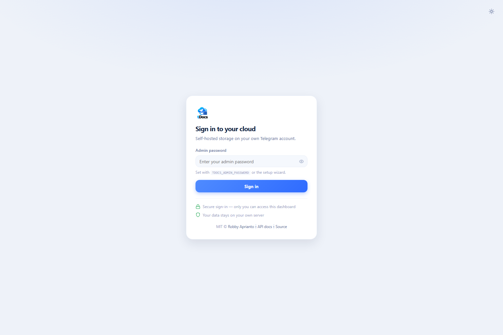
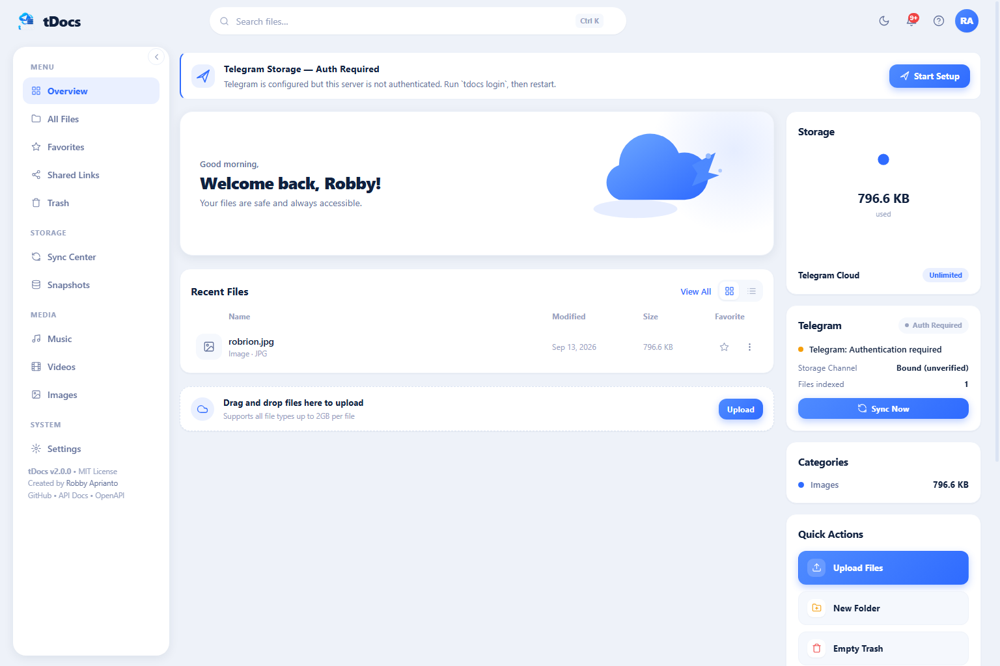
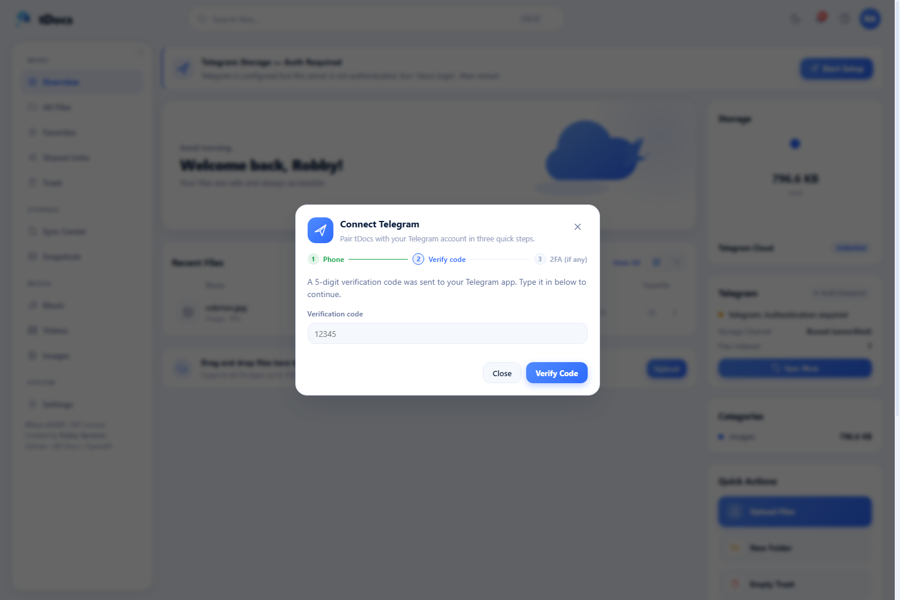

<div align="center">

# ⚡ tDocs

**Cloud storage pribadi bertenaga Telegram MTProto — single binary, console dashboard, API siap embed.**

[](https://go.dev/)
[](LICENSE)
[-orange)](https://modernc.org/sqlite)

</div>

> **English:** tDocs turns your Telegram account into a secure personal cloud drive: dark-first console dashboard with storage analytics, resumable uploads, HTTP 206 streaming, share links, trash + versions, automated snapshots, and a public CDN + OpenAPI for embedding files (e.g. a film site) anywhere.

## 📸 Tampilan






## ✨ Fitur

- **Dashboard Console** — dark-first professional layout (sidebar + main content, storage analytics inline), statistik, full-circle storage gauge, breakdown per tipe, **My Folders** cards, quick upload dropzone, recent files, duplicate detection, Grid/Table view + sorting, drag & drop, light/dark mode, video/audio/image/PDF/code preview. Responsif mobile/tablet/desktop.
- **Media Center** — dedicated Music/Videos/Images library with persistent mini-player (audio queue, seek, volume, speed, repeat/shuffle, playlist), video player with PiP, fullscreen, subtitle support, and image gallery with navigation. **Mini-player bisa di-minimize** jadi pill kaca kompak (cover berputar saat playing, judul, play/next, garis progres, tombol restore/close) dan pilihannya tersimpan di `localStorage` — tetap terlihat saat berpindah tab. Playback latency diblokir dua cara: video dimuat `preload=metadata` + stream **di-resolve/ dipanaskan sebelum** tombol play ditekan, dan resolusi `msg_id → document` di-cache singkat sehingga request `Range` berurutan (seek/pause/resume) tidak lagi memanggil Telegram API tiap kali.
- **Sidebar bisa dilipat & dibuka lagi** — handle collapse di desktop, tombol reopen yang benar-benar muncul setelah dilipat, dan preferensi tidak merusak drawer mobile (collapse hanya aktif ≥1200px).
- **Status koneksi Telegram jujur** — badge hanya menulis **Connected** setelah probe jaringan nyata berhasil (cache 30 detik; tombol *Test Connection* selalu memaksa probe baru). State yang tampil: `NOT CONFIGURED`, `CONNECTING`, `AUTHENTICATION REQUIRED`, `CONNECTED`, `DISCONNECTED`, `ERROR`. Endpoint yang butuh storage mengembalikan `503 telegram_storage_unavailable` + state, bukan error 500 atau daftar kosong palsu.
- **Telegram Setup Wizard (superuser)** — Settings → Telegram Storage, 7 langkah: penjelasan storage backend → kredensial (secret tidak pernah dikirim balik ke browser setelah disimpan) → autentikasi (OTP/2FA, sesi terenkripsi) → pilih Storage Channel + verifikasi izin → **Test Connection nyata** → Initial Sync (progress + retry item gagal) → ringkasan terverifikasi. Seluruh rute wizard/status/test hanya bisa diakses superuser di sisi server (`superuserOnly`), bukan sekadar disembunyikan di UI.
- **Pairing Telegram 100% lewat web** — tidak perlu `tdocs login` dari terminal lagi: buka Settings → Telegram Storage, masukkan nomor HP, terima kode OTP dari Telegram, masukkan kodenya (+ password 2FA bila ada). Wizard mengirim kode sungguhan, menunggu input, dan melaporkan error apa adanya (mis. kode salah) — tidak pernah "done" palsu. Seluruh endpoint wizard superuser-only.
- **Upload resumable** — 5 MB/chunk → 512 KB part MTProto, antrean + **pause/resume/retry**, hash SHA-256 per upload untuk deteksi duplikat, tanpa memenuhi disk server.
- **Manajemen file** — bulk select + bulk action (trash/restore/purge/move/favorite), context menu (klik kanan), details drawer + **versioning otomatis** (upload nama sama mengarsipkan versi lama), favorites, **Trash** (restore/purge), filter tipe/ukuran, breadcrumbs.
- **Share link aman** — token acak + password (Argon2id) + masa berlaku + **batas download**, ada QR buat handoff ke HP.
- **Sync Center** — kesehatan backend Telegram, riwayat sync, recovery satu klik; katalog dibangun ulang otomatis dari channel saat start (tahan restart).
- **Snapshot otomatis** — backup SQLite tiap 24 jam & saat shutdown, retensi 5 snapshot, restore point-in-time dari dashboard.
- **CDN publik + API** — tiap file punya `stream_url`/`download_url` siap pasang di `<video>` (Range 206, ETag, CORS terbuka), katalog JSON, token API, signed URL download, Swagger di `/docs`.
- **Keamanan nyata** — sesi acak httpOnly (+Secure saat TLS), CSRF token, rate limiting, security headers (CSP, anti-clickjacking), password Argon2id, API token hash, audit log, TLS opsional. Detail: [SECURITY.md](SECURITY.md).
- **Safe Mode** — antrean upload sekuensial (1 koneksi), pacing adaptif, backoff `FLOOD_WAIT` otomatis, channel `tDocs Vault` privat. Session MTProto terenkripsi AES-256-GCM.

## 🚀 Mulai (pilih 1 cara)

Butuh `API_ID` + `API_HASH` dari [my.telegram.org](https://my.telegram.org) → API development tools (sekali saja).

**Cara 1 — paling gampang (Go):**
```bash
make start
# setup (wizard .env) → login (OTP) → browser terbuka → http://localhost:8080
```

**Cara 2 — Docker:**
```bash
cp .env.example .env   # isi TDOCS_TG_APP_ID + TDOCS_TG_APP_HASH
docker compose up -d --build
docker compose exec tdocs tdocs login   # pairing OTP, sekali saja
# buka http://localhost:8080 (password: isi TDOCS_ADMIN_PASSWORD)
```

Image runtime berbasis `alpine:3.21` (~76 MB) dan **tanpa `apk add` saat build**
(CA bundle disalin dari stage build), jadi build tidak bergantung ke mirror paket.
Kalau mirror Docker Hub / proxy sedang lambat, tambahkan `--network=host`:
```bash
docker build --network=host -t tdocs:2.0.0 .
```
Build context dijaga kecil lewat `.dockerignore` (binary lokal, `*.db`, `.env`,
`*.key` tidak ikut terkirim ke daemon).

**Cara 3 — Node:**
```bash
npm start    # sama dengan: npx tdocs start
```

Manual bila perlu: `make build` → `./tdocs setup` → `./tdocs login` → `./tdocs server`.
Cek masalah kapan saja: `./tdocs doctor`.

## 🛠️ Manajemen server (`manage.sh`)

Satu skrip untuk running, update, restart, status, dsb (jalan dari mana saja,
env `TDOCS_*` selalu menang atas `.env`):

```bash
./manage.sh start [foreground]  # background (log: tdocs.log), deteksi port aktual
./manage.sh stop                # graceful, tunggu snapshot shutdown
./manage.sh restart             # stop + start
./manage.sh status              # PID/uptime, URL, Telegram, jumlah file
./manage.sh logs [-f|N]         # tail log (default 100 baris)
./manage.sh sync                # pulihkan katalog dari channel Telegram
./manage.sh snapshot            # backup DB sekarang → Storage Channel
./manage.sh open                # buka dashboard di browser
./manage.sh update              # git pull (bila git) + rebuild, restart bila sedang jalan
./manage.sh doctor|backup|sync|login|...   # teruskan ke binary tdocs
./manage.sh service-install [--user]       # systemd auto-start saat boot
./manage.sh service-remove [--user]
```

## 💻 CLI

```bash
./tdocs setup               # wizard .env sekali saja
./tdocs start               # jalan pintas: setup → login → server + browser
./tdocs doctor              # cek config/db/session/port
./tdocs upload ./film.mp4 --folder <folder_id>
./tdocs download <file_id> --output ./film.mp4
./tdocs list
./tdocs backup              # snapshot sekarang ke Telegram
./tdocs restore             # pulihkan dari snapshot Telegram
./tdocs login --reset       # pairing ulang (wajib setelah ganti secret)
./tdocs logout              # hapus session tersimpan
./tdocs passwd <new-password>  # ganti password dashboard (Argon2id)
./tdocs passwd --clear         # hapus override → kembali ke TDOCS_ADMIN_PASSWORD
```

## 🎬 CDN + API buat website film

```bash
# Katalog (ganti ADMIN_PASS dengan password admin)
curl -H "Authorization: Bearer ADMIN_PASS" \
  "http://localhost:8080/api/cdn/files?mime=video/&limit=100"
# -> {"files":[{"id","name","size","mime_type","stream_url","download_url"}],"total":1}
```

```html
<video controls preload="metadata" src="http://localhost:8080/cdn/<file_id>/stream"></video>
```

| Endpoint | Auth | Kegunaan |
| :--- | :--- | :--- |
| `GET /api/cdn/files?search=&mime=video/&limit=` | Bearer/token/cookie | Katalog JSON + `stream_url` |
| `GET /api/cdn/files/{id}` | sama | Detail 1 file + URL embed |
| `GET /cdn/{id}/stream` | publik* | Embed `<video>/<audio>/` (Range, HEAD, ETag) |
| `GET /cdn/{id}/download` | publik* | Download `attachment` |
| `POST /api/share` `{file_id, password?, expiry_days?, max_downloads?}` | cookie/Bearer | Buat share link → `{token, page_url, stream_url, download_url}` |
| `POST /api/sync` | cookie/Bearer | Bangun ulang katalog file dari channel Telegram (pulih setelah DB hilang) |
| `GET /api/sync/runs` | cookie/Bearer | Riwayat sync |
| `GET /api/files`, `GET /api/files/{id}` | cookie/Bearer | List & detail file dashboard |
| `GET /api/files/{id}/meta` | cookie/Bearer | File + favorite/versions/shares/duplicates |
| `POST /api/files/{id}/ticket` | cookie/Bearer | URL download bertanda tangan + kedaluwarsa |
| `POST /api/files/bulk` | cookie/Bearer | Bulk trash/restore/purge/move/favorite |
| `GET /api/favorites`, `GET /api/duplicates`, `GET /api/stats` | cookie/Bearer | Favorit, duplikat SHA-256, analitik |
| `GET /api/trash`, `POST /api/trash/restore`, `DELETE /api/trash/…`, `POST /api/trash/empty` | cookie/Bearer | Sampah: list/restore/purge |
| `GET /api/files/{id}/versions` … | cookie/Bearer | List/restore/delete versi file |
| `GET /api/audit` | cookie/Bearer | Audit log |
| `GET/POST /api/tokens`, `DELETE /api/tokens/{id}` | cookie/Bearer | Kelola API token |
| `GET /api/sessions`, `DELETE /api/sessions/{id}` | cookie/Bearer | Sesi web aktif |
| `POST /api/settings/password` | cookie/Bearer | Ganti password admin (Argon2id) |
| `GET /api/health`, `GET /api/status` | cookie/Bearer | Kesehatan runtime/server |
| `GET /api/openapi.json`, `GET /docs` | — | Spesifikasi OpenAPI 3.0 + Swagger UI |

\*Set `TDOCS_CDN_PUBLIC=false` untuk mengunci `/cdn/*` di balik Bearer key. Set `TDOCS_CDN_BASE_URL=https://domain.mu` bila di-reverse-proxy agar URL di JSON memakai domain publik.

Bearer = `Authorization: Bearer <password admin | API token>` atau `?api_key=`. Mutasi via cookie wajib header `X-CSRF-Token` (diambil dari cookie `tdocs_csrf`).

## ⚙️ Konfigurasi

| Variable | Default | Keterangan |
| :--- | :--- | :--- |
| `TDOCS_PORT` / `TDOCS_HOST` | `8080` / `0.0.0.0` | Bind dashboard |
| `TDOCS_DB_PATH` | `tdocs.db` | File SQLite (`robdocs.db`/`teledrive.db` lama tetap dipakai bila ada) |
| `TDOCS_ADMIN_PASSWORD` | `admin123` | Password dashboard + Bearer key API (bisa diganti via Settings → hash Argon2id di DB) |
| `TDOCS_SECRET_KEY` | auto (`.tdocs.key`) | Enkripsi session + kunci HMAC tiket; ganti → wajib `login --reset` |
| `TDOCS_TG_APP_ID` / `TDOCS_TG_APP_HASH` | *(wizard)* | Dari `my.telegram.org` (baca juga `.env`: `app_api_id`/`app_api_hash`) |
| `TDOCS_CDN_PUBLIC` / `TDOCS_CDN_BASE_URL` | `true` / host request | Kontrol CDN publik & base URL katalog |
| `TDOCS_TLS_CERT_FILE` / `TDOCS_TLS_KEY_FILE` | *(kosong)* | Aktifkan HTTPS bila keduanya diisi |
| `TDOCS_BACKUP_INTERVAL` | `24h` | Interval snapshot otomatis (format durasi Go) |

Semua variabel juga dibaca dengan prefix warisan `ROBDOCS_*` lalu `TELEDRIVE_*`.

## 🔒 Model keamanan (ringkas)

- Sesi dashboard = token acak 256-bit (httpOnly, SameSite=Lax, Secure saat TLS), disimpan server-side 30 hari; logout me-revoke. Cookie statis lama tidak berlaku lagi → login ulang sekali.
- Mutasi via cookie wajib CSRF; klien Bearer/API-token bebas CSRF (tanpa ambient authority).
- Password admin & share: Argon2id (bcrypt lama tetap terverifikasi). API token: acak 256-bit, hanya hash SHA-256 yang disimpan, tampil sekali.
- Rate limit: login 15/menit/IP, API 600/menit/IP. Header aman: CSP, `frame-ancestors 'self'`, nosniff, referrer, permissions. HSTS saat TLS.
- Download bisa memakai URL bertanda tangan HMAC + kedaluwarsa (`POST /api/files/{id}/ticket`).
- Audit log untuk login, upload, hapus, share, snapshot, sync, token, password.
- Jujur soal enkripsi: yang terenkripsi AES-256-GCM adalah **session/auth Telegram**; byte file mengandalkan transport + penyimpanan Telegram (tDocs tidak mengklaim E2E file). Kredensial API Telegram disimpan sebagai pengenal klien; kunci akses akun (session) terenkripsi.

## 🔌 Status Telegram & Storage Adapter

Semua fitur berbasis Telegram berjalan di balik abstraksi `internal/storage`
(`Backend`), jadi S3/MinIO/local bisa ditambahkan tanpa menulis ulang aplikasi:

```
tDocs UI → API/Core → Storage Adapter → Telegram Storage
```

- `GET /api/telegram/state` — state terverifikasi terakhir (superuser).
- `POST /api/telegram/test` — probe langsung: API reachable → auth valid → Storage Channel bisa diakses → izin baca/tulis.
- Handler yang butuh storage memakai `requireTelegram`; bila belum siap, responsnya 503 + state, tidak pernah sukses palsu.
- Tanpa kredensial Telegram, aplikasi masuk mode **"Telegram Storage — Not Configured"**; folder lokal, trash, favorit, share, preview, dan media player tetap berfungsi.
- **UX anti-overflow**: header search turun ke baris kedua di ≤820px (bukan disembunyikan seperti versi lama); 7 lebar QA (1440→360px) nol horizontal overflow.
- **XSS hardening**: nama file/folder dengan kutip (`O'Brien`, `<tag>`, `&`) dirender aman lewat helper `ja()` ganda-escape di semua inline handler; sudah diuji dengan login, search, preview, share, rename di semua breakpoint.

## 🔑 Lupa password dashboard

Login salah berkali-kali menampilkan halaman rate-limit yang jelas (bukan error
mentah), dan password yang benar **tetap diterima** — limiter hanya memakan
percobaan gagal. Kalau password benar-benar lupa, reset dari konsol server:

```bash
./tdocs passwd 'password-baru-yang-kuat'   # set hash Argon2id baru
./tdocs passwd --clear                     # hapus override → pakai TDOCS_ADMIN_PASSWORD
```

Setelah reset, restart server agar daftar sesi ikut bersih: `./tdocs server`.

## 🛠️ Masalah umum

- **`decrypt session: cipher: message authentication failed`** → secret berubah. Solusi: `./tdocs login --reset`, lalu restart server.
- **Upload gagal semua** → biasanya MTProto belum login; cek log server, pairing ulang bila perlu.
- **File hilang setelah restart / database kosong** → metadata dibangun ulang otomatis dari channel Telegram saat server mulai. Bisa juga dipicu manual dari **Sync Center** atau `POST /api/sync`.
- **`403 CSRF token missing`** di script sendiri → kirim header `X-CSRF-Token` (cookie `tdocs_csrf`), atau pakai Bearer/API token.

## 📚 Lanjutan

- [docs/USER_GUIDE.md](docs/USER_GUIDE.md) — cara kerja & panduan lengkap
- [ARCHITECTURE.md](ARCHITECTURE.md) · [SECURITY.md](SECURITY.md) · [CONTEXT.md](CONTEXT.md) · [docs/adr/](docs/adr/)

---

Dibuat oleh **Robby Aprianto** ([@robprian](https://github.com/robprian)) · [Source](https://github.com/robprian/tDocs) · [MIT](LICENSE)

> Upgrade dari RobDocs/TeleDrive: variabel `ROBDOCS_*`/`TELEDRIVE_*`, `robdocs.db`/`teledrive.db`, `.robdocs.key`/`.teledrive.key`, cookie lama, channel `RobDocs Vault`/`TeleDrive Vault`, dan snapshot `robdocs-backup-*`/`teledrive-backup-*` tetap terbaca otomatis.
